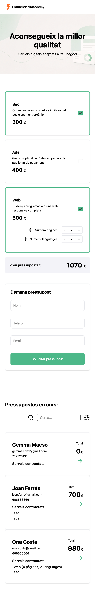
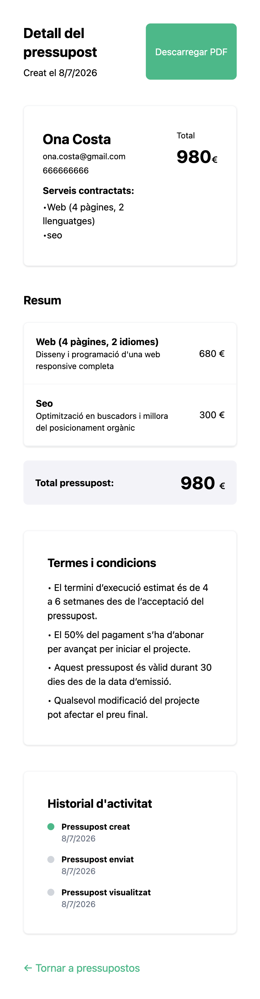
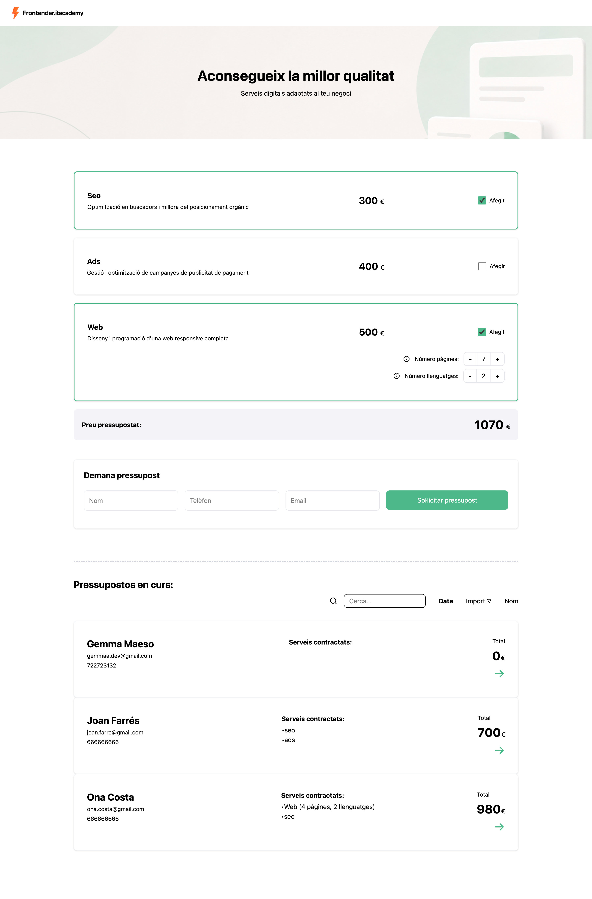
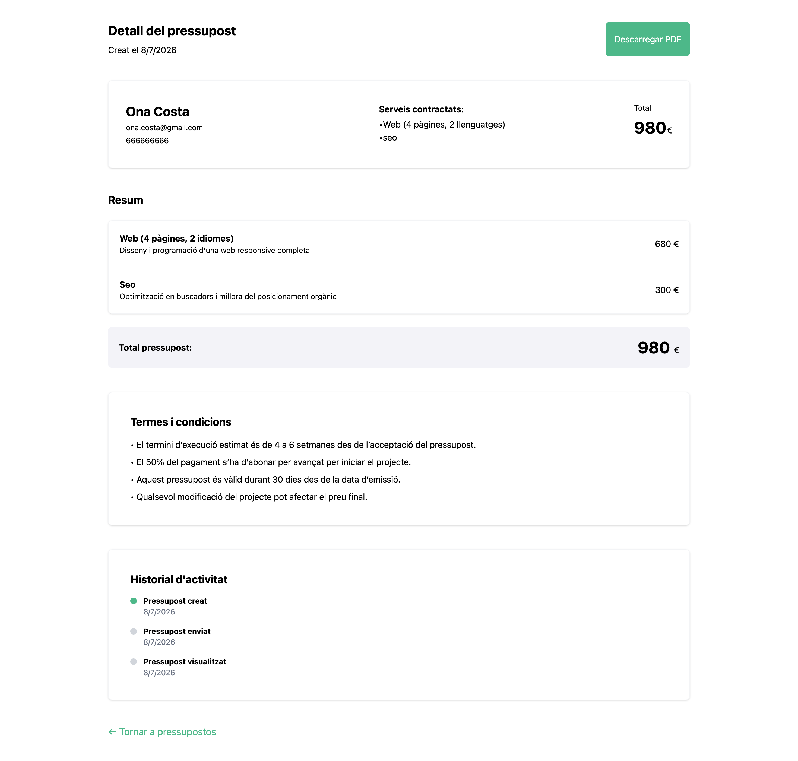

<div align="center">

### Budget App · Project 2 · IT Academy Barcelona

Generate, manage and share digital service budgets with real-time price calculation, budget history and shareable URLs.

[🚀 Live Demo](https://budget-app-digital-services.netlify.app/)


</div>

---

## Preview

### 📱 Mobile

| Homepage | Budget detail |
| -------- | ------------- |
|  |  |

### 🖥️ Desktop

| Homepage | Budget detail |
| -------- | ------------- |
|  |  |

---

## Core features

### Budget calculator

- Select one or more digital services (SEO, ADS, Web)
- Dynamic real-time price calculation
- Web service configurator with number of pages and languages
- Informational modal for each configurable option

### Budget generation

- Client form with real-time validation (name, phone, email)
- Unique ID and creation date per budget
- Budget saved to localStorage on submission
- Form and service selection reset after submission

### Budget history

- List of all budgets with client info, services and total
- Search by client name in real time
- Sort by date, total or name
- Shareable link to budget detail page

### Budget sharing

- Each budget is shareable via a unique URL (Base64 encoded)
- Full budget detail page with client info, services summary, terms and activity history
- PDF export with all budget information

---

## Tech stack

| Category        | Technology                                            |
| --------------- | ----------------------------------------------------- |
| Framework       | [React 18](https://react.dev/)                        |
| Language        | [TypeScript](https://www.typescriptlang.org/)         |
| Bundler         | [Vite](https://vitejs.dev/)                           |
| Styles          | [Tailwind CSS v4](https://tailwindcss.com/)           |
| Routing         | [React Router v6](https://reactrouter.com/)           |
| PDF Export      | [jsPDF](https://github.com/parallax/jsPDF)            |
| Icons           | [Lucide React](https://lucide.dev/)                   |
| Testing         | [Vitest](https://vitest.dev/) + React Testing Library |
| Version Control | Git + GitHub (Git Flow)                               |

---

## Getting started

### Prerequisites

- Node.js >= 18
- npm >= 9

### Installation

```bash
# 1. Clone the repository
git clone https://github.com/gemmaadev/budget-app-digital-services.git

# 2. Navigate to the project directory
cd budget-app-digital-services

# 3. Install dependencies
npm install

# 4. Start the development server
npm run dev
```

The app will be available at the URL shown in your terminal after running `npm run dev`

---

## Testing

```bash
# Run all tests
npm run test

# Generate coverage report
npm run test:coverage
```

### Test coverage

| Category | Coverage |
| -------- | -------- |
| Statements | 90.66% |
| Branches | 88.88% |
| Functions | 90.9% |
| Lines | 90.76% |

_Tests written following Gherkin scenarios (Given / When / Then)._

---

## Project structure

```
budget-app/
├── public/
├── src/
│   ├── assets/
│   │   ├── images/
│   │   └── logos/
│   ├── data/
│   │   └── services.json           # Configurable services data
│   ├── features/
│   │   ├── budget-calculator/      # Service selection and price calculation
│   │   │   ├── components/
│   │   │   │   ├── BudgetSummary.tsx
│   │   │   │   ├── ServiceCard.tsx
│   │   │   │   └── WebConfigurator.tsx
│   │   │   ├── hooks/
│   │   │   │   ├── useBudgetCalculator.ts
│   │   │   │   └── useBudgetCalculator.test.ts
│   │   │   ├── types/
│   │   │   │   └── service.ts
│   │   │   └── BudgetCalculatorSection.tsx
│   │   ├── budget-form/            # Client form and budget persistence
│   │   │   ├── components/
│   │   │   │   ├── ClientForm.tsx
│   │   │   │   ├── ClientForm.test.tsx
│   │   │   │   └── FormField.tsx
│   │   │   └── hooks/
│   │   │       ├── useBudgetForm.ts
│   │   │       └── useBudgetForm.test.ts
│   │   ├── budget-history/         # Budget list with search and sort
│   │   │   ├── components/
│   │   │   │   ├── BudgetCard.tsx
│   │   │   │   └── SearchAndSort.tsx
│   │   │   ├── hooks/
│   │   │   │   ├── useBudgetHistory.ts
│   │   │   │   └── useBudgetHistory.test.ts
│   │   │   └── BudgetHistorySection.tsx
│   │   └── budget-share/           # Budget detail and PDF export
│   │       ├── components/
│   │       │   ├── BudgetDetailActivity.tsx
│   │       │   ├── BudgetDetailHeader.tsx
│   │       │   ├── BudgetDetailSummary.tsx
│   │       │   └── BudgetDetailTerms.tsx
│   │       └── hooks/
│   │           └── useExportPDF.ts
│   ├── pages/
│   │   ├── BudgetDetailPage.tsx    # /budgets?data=...
│   │   ├── HomePage.tsx            # /
│   │   └── NotFound.tsx            # *
│   ├── shared/
│   │   ├── types/
│   │   │   └── budget.ts           # Budget and ClientData interfaces
│   │   └── utils/
│   │       ├── calculateWebPrice.ts
│   │       ├── calculateWebPrice.test.ts
│   │       ├── encodeBudget.ts
│   │       └── encodeBudget.test.ts
│   ├── App.tsx
│   ├── index.css
│   ├── main.tsx
│   └── setupTests.ts
├── index.html
├── vite.config.ts
├── package.json
└── README.md
```

---

## Component tree

```
App.tsx
├── HomePage (/)
│   ├── <nav> — logo
│   ├── <header> — hero banner
│   └── <main>
│       ├── BudgetCalculatorSection
│       │   ├── ServiceCard (x3)
│       │   │   └── WebConfigurator (conditional)
│       │   ├── BudgetSummary
│       │   └── ClientForm
│       │       └── FormField (x3)
│       └── BudgetHistorySection
│           ├── SearchAndSort
│           └── BudgetCard (xN)
├── BudgetDetailPage (/budgets?data=...)
│   ├── BudgetDetailHeader
│   ├── BudgetCard (showLink=false)
│   ├── BudgetDetailSummary
│   ├── BudgetDetailTerms
│   └── BudgetDetailActivity
└── NotFound (*)
```

---

## Architecture decisions

- **Feature-based architecture** — each feature is self-contained with its own components, hooks and types
- **Shared utilities** — `Budget` and `ClientData` types and reusable utils live in `shared/`
- **URL sharing via Base64** — budgets are encoded with `btoa(JSON.stringify(budget))` and decoded with `JSON.parse(atob(encoded))` — no backend required
- **localStorage persistence** — budgets are saved to localStorage; a global state solution (Context API or Zustand) would improve real-time sync between sections in a future iteration

---

## Author

**Gemma Maeso** · [@gemmaadev](https://github.com/gemmaadev)

Project developed as part of the **IT Academy** program by Barcelona Activa  